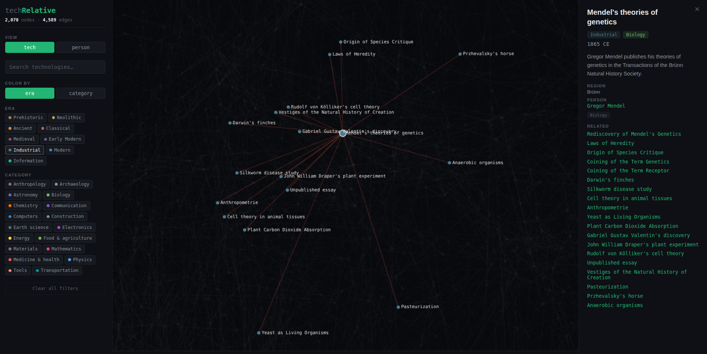
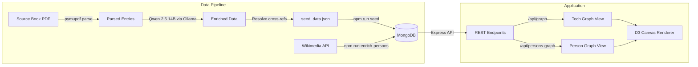

# tech**Relative**

An interactive graph visualization of ~6,500 technologies and their relationships, spanning from prehistory to the modern era.



## About

techRelative maps the connections between thousands of historical technologies, inventions, and discoveries — revealing how ideas influenced each other across centuries. The dataset covers roughly 6,500 technologies from the Stone Age through the Information Age, linked by relationships like _led to_, _enabled_, _inspired_, and _improved_.

You can explore the data as a **technology graph** (nodes are inventions/discoveries) or switch to a **person graph** (nodes are historical figures, connected by shared technological contributions). Select any node to see its details, related technologies, and Wikipedia links for the people involved.

## Tech Stack

| Layer         | Technology                                            | Why                                                                                                                     |
| ------------- | ----------------------------------------------------- | ----------------------------------------------------------------------------------------------------------------------- |
| Visualization | **D3.js** with Canvas rendering                       | Canvas over SVG for performance — the graph renders thousands of nodes at interactive frame rates                       |
| Frontend      | **React 19**, **TypeScript**, **Zustand**             | Zustand keeps graph state (filters, selections, view mode) simple and performant without prop drilling                  |
| Backend       | **Express**, **TypeScript**, **Zod**                  | Zod validates seed data and API inputs at the boundary; MongoDB aggregation pipelines handle the graph queries          |
| Database      | **MongoDB 7**                                         | Document model fits the heterogeneous technology data naturally; `$lookup` pipelines derive the person graph on the fly |
| DevOps        | **Docker Compose**, **Nginx**                         | Single `docker compose up` runs the full stack; Nginx serves the static frontend build                                  |
| Testing       | **Vitest**, **React Testing Library**, **Playwright** | Unit/component/integration tests plus E2E coverage for critical user flows                                              |
| Extraction    | **Python**, **pymupdf**, **Ollama** (Qwen 2.5 14B)   | pymupdf provides span-level font metadata needed for deterministic PDF parsing; local LLM handles paraphrasing          |

## Architecture



### Data Pipeline

The extraction pipeline (`backend/scripts/extract_technologies.py`) uses a hybrid approach: deterministic PDF parsing with pymupdf extracts structured entries by classifying font sizes and bold flags (year headers, category names, body text, cross-references), then a local LLM (Qwen 2.5 14B via Ollama) extracts technology names, descriptions, regions, and people from the parsed text blocks. Cross-references embedded in the book ("See also 1865 BIO") are resolved into relationship edges between technologies.

The resulting dataset (`seed_data.json`, ~6,500 technologies and their relations) is seeded into MongoDB, then enriched with Wikipedia metadata for biographical links and thumbnails.

### API Layer

The backend exposes graph-optimized endpoints with filtering by era and category, 5-minute caching for expensive graph queries, and aggregation pipelines that derive person profiles and person-to-person relationships from the underlying technology data.

### Visualization

The frontend renders a force-directed graph on HTML Canvas using D3. Nodes are positioned temporally along a year axis, colored by era or category, and connected by relationship edges. Selecting a node highlights its neighborhood and opens a detail panel.

## Features

- **Dual graph views** — explore by technology or by historical figure
- **Temporal layout** — nodes positioned by year, giving a visual timeline of innovation
- **Era and category filtering** — toggle visibility across 9 historical eras and 20+ categories
- **Search** — find technologies or people by name with real-time highlighting
- **Detail panel** — descriptions, related technologies, Wikipedia links, and biographical info
- **Mobile responsive** — adapts layout for portrait and landscape orientations

## Getting Started

### Prerequisites

- [Docker](https://docs.docker.com/get-docker/) and Docker Compose
- A MongoDB instance (local via Docker or [MongoDB Atlas](https://www.mongodb.com/atlas))

### Run with Docker Compose

```bash
git clone https://github.com/meckgale/techRelative.git
cd techRelative

# Configure your MongoDB connection
cp backend/.env.example backend/.env
# Edit backend/.env with your MONGO_URL

# Start all services
docker compose up --build
```

The app will be available at `http://localhost`.

### Seed the Database

On first run (or after clearing the database):

```bash
cd backend
npm install
npm run seed              # Load technologies and relations
npm run enrich-persons    # Fetch Wikipedia data for people
```

### Local Development (without Docker)

```bash
# Backend
cd backend
npm install
npm run dev               # Express server on :3001

# Frontend (in a separate terminal)
cd frontend
npm install
npm run dev               # Vite dev server on :5173
```

### Run Tests

```bash
# Unit and integration tests
cd frontend && npm test
cd backend && npm test

# End-to-end tests
npm run e2e
```

## Data Sources and Acknowledgments

Technology relationships and historical data were derived from _The History of Science and Technology_ by Bryan Bunch and Alexander Hellemans. All descriptions have been independently paraphrased. Biographical links and thumbnails are sourced from Wikipedia via the Wikimedia API.

This is a non-commercial, educational portfolio project and is not affiliated with or endorsed by the original authors or publisher.
